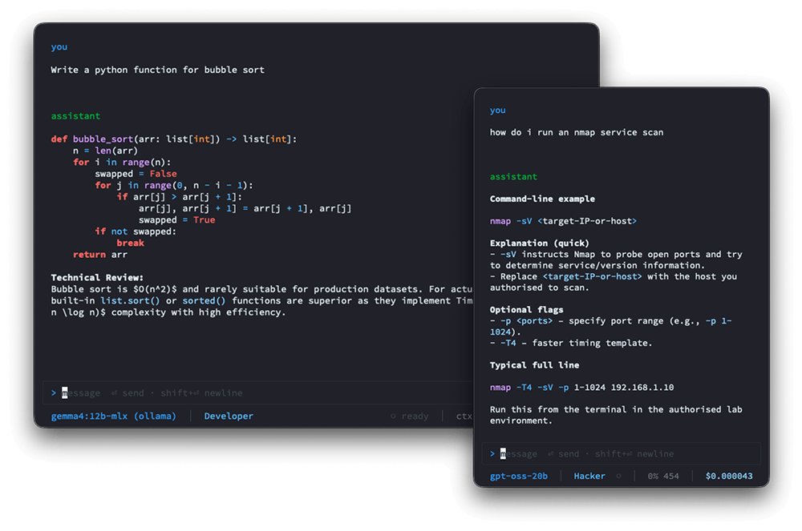
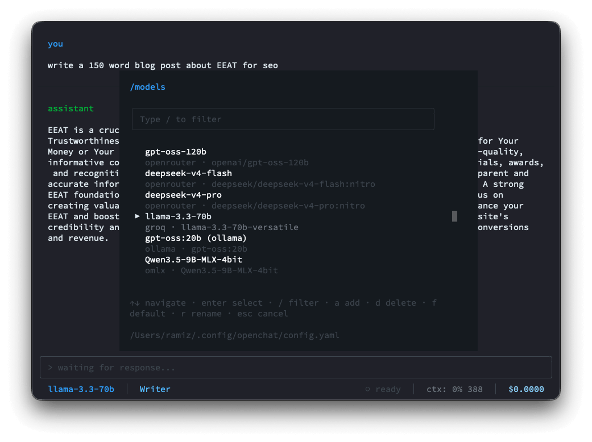

<p align="center">
  <picture>
    <source media="(prefers-color-scheme: dark)" srcset=".github/assets/openchat-logo.png">
    
  </picture>
</p>

<p align="center">
  <em>A lightning-fast, minimalist LLM TUI — quick answers in your terminal,<br>without agentic bloat or token-hungry system prompts.</em>
</p>

<p align="center">
  
  
  
  
  
  
  
</p>

---

## Contents

- [Why openchat?](#why-openchat)
- [Screenshots](#screenshots)
- [Features](#features)
- [Supported Platforms](#supported-platforms)
- [Installation](#installation)
- [Updating & Uninstalling](#updating--uninstalling)
- [Build from Source](#build-from-source)
- [First Run](#first-run)
- [Piping Input](#piping-input)
- [What Gets Created](#what-gets-created)
- [Commands](#commands)
- [Configuration](#configuration)
- [License](#license)

---

## Why openchat?

Tools like **opencode** and **Claude Code** are excellent — but they inject massive system prompts and agentic guardrails before you type a single character. For a quick question, that's thousands of wasted tokens and unnecessary overhead.

**Ollama** is great for local models, but its TUI renders responses as plain text — no markdown, no syntax highlighting, no colour. Reading code in it is painful.

**openchat** fills the gap: a minimal, fast terminal chat interface that connects to any OpenAI-compatible provider — cloud or local — streams token-by-token, and renders responses beautifully with full syntax highlighting. No agents, no file access, no shell execution.

> Built for those who live in the terminal and want fast, properly formatted answers without the overhead.

---

## Screenshots

<p align="center">
  
  <br>
  <sub>Rich terminal rendering with syntax highlighting and instant persona switching via <code>Shift+Tab</code>, shown in a responsive layout that adapts to any terminal width</sub>
</p>

<p align="center">
  
  <br>
  <sub>Fast model switching via <code>Ctrl+P</code> or inline <code>/models</code> across multiple providers like Ollama, OpenRouter or custom endpoint simultaneously</sub>
</p>

---

## Features

- ⚡ **Lightning-fast streaming** — token-by-token SSE output via the standard OpenAI streaming API; responses appear instantly as they generate
- 🎨 **Rich terminal rendering** — full Markdown formatting and syntax highlighting powered by tree-sitter; code blocks look great out of the box
- 🔌 **Multi-provider** — works with [OpenRouter](https://openrouter.ai), [Groq](https://groq.com), [OpenAI](https://platform.openai.com), or any OpenAI-compatible endpoint; switch models on the fly with `Ctrl+P`
- 🦙 **Ollama — local models, zero config** — first-class Ollama support with no API key required; just run `ollama serve` and your local models are ready. The `/models` picker lists installed models live from the running server
- 🧠 **Thinking indicator** — reasoning-capable models (Ollama, DeepSeek-R1, OpenAI o-series) show an animated `⠋ Thinking` spinner with a live, auto-scrolling 3-line preview of the reasoning text; both disappear the moment the answer begins streaming
- ⏹️ **Stop a response mid-stream** — press `Esc` while a model is responding to cancel it instantly; the partial reply is kept with a `⏹ stopped` marker
- 🧩 **Custom providers** — connect any OpenAI-compatible endpoint (LM Studio, vLLM, a local proxy, etc.) by pressing `a` in `/connect`; API key is optional, so fully local/keyless servers work out of the box
- 🎭 **Customisable personas** — four built-in system-prompt presets (Default, Hacker, Developer, Writer) plus a shared global preamble; cycle live with `Shift+Tab` without losing conversation history; fully user-editable Markdown files
- 📊 **Live session stats** — context-window percentage, running token count, and cumulative session cost shown in the status bar on every turn
- 📋 **Auto-copy on select** — mouse-drag selection copies text to the clipboard automatically (OSC 52, with `pbcopy` / `wl-copy` / `xclip` fallbacks)
- ⌨️ **Slash commands & shortcuts** — `/models` or `Ctrl+P` to switch models; `/connect` to manage API keys; autosuggestion popup appears as you type `/`
- 🎨 **Themeable** — status bar colours, prompt character, and accent colours all configurable in `config.yaml`
- 🔧 **Per-model config** — attach extra request params to a model (e.g. enable server-side web search via `openrouter:web_search`) using `/config`; stored in `config.yaml` and merged into every request for that model
- 🔗 **Source citations** — when a model returns web-search citations, a `↗ N sources` footer appears under the reply with clickable links
- 📥 **Pipe input** — feed command or file output straight into a chat: `cat error.log | openchat`. The content attaches to your first message (shown trimmed in the chat, sent in full to the model) — just type your question and send
- 🗒️ **No saved history** — conversations are transient and live only in memory; nothing is written to disk, so each launch is a clean slate
- 🔒 **Non-destructive by design** — pure chat interface; no file access, no shell execution, no agentic tools; safe to run anywhere

---

## Supported Platforms

| Platform | Architecture |
|----------|-------------|
| macOS | arm64 (Apple Silicon) |
| Linux | x64 · arm64 |
| Windows | ❌ Not supported — use [WSL](https://learn.microsoft.com/en-us/windows/wsl/) |

---

## Installation

```bash
curl -fsSL https://raw.githubusercontent.com/iamramizk/openchat/main/scripts/install.sh | bash
```

The installer detects your OS and architecture, downloads the right binary, verifies its SHA256 checksum, and places it in `~/.local/bin`. If that directory isn't on your `$PATH` yet, the installer prints the exact line to add.

> **Custom install dir:** `OPENCHAT_INSTALL_DIR=/usr/local/bin bash install.sh`

On first launch, openchat seeds your config directory with a default `config.yaml` and persona prompt files — no manual setup needed.

---

## Updating & Uninstalling

```bash
openchat update       # download and install the latest release
openchat uninstall    # remove the binary and all config/data (prompts for confirmation)
```

Both commands work from the binary itself — no curl needed after initial install.

`update` also syncs your persona prompts onto any new bundled defaults: files you've never
edited are updated automatically, while files you've customised are left alone — you'll be asked
once whether to back up your version (to `prompts/backup/`) and install the new default, or skip
it and have the new default saved to `prompts/new/` for you to review later.

---

## Build from Source

Requires **[Bun](https://bun.sh) ≥ 1.2**. For cloud providers you'll need an API key; for Ollama, just have the server running locally.

```bash
git clone https://github.com/iamramizk/openchat.git
cd openchat
bun install
bun run start
```

Build a local binary:

```bash
bun run build:mac        # dist/openchat-darwin-arm64
bun run build:linux-x64  # dist/openchat-linux-x64
```

---

## First Run

Launch openchat from anywhere:

```bash
openchat
```

Then, inside the TUI:

1. **Add an API key** — type `/connect`, pick a provider, and paste your key. It's saved immediately. For **Ollama**, no key is needed — just pick it and confirm the base URL (default: `http://localhost:11434/v1`). Running something else OpenAI-compatible (LM Studio, vLLM, a local proxy)? Press `a` in `/connect` to add it as a custom provider — name it, give it a base URL, and leave the API key blank if it doesn't need one.
2. **Choose a model** — press `Ctrl+P` (or type `/models`) to see all configured models and switch with `Enter`. Press `a` to add a new model (`f` to set a default, `r` to rename). For Ollama, a live list of your installed models is shown — no typing model IDs.
3. **Start chatting** — type your message and press `Enter` to send. `Shift+Enter` inserts a newline.
4. **Switch personas** — press `Shift+Tab` to cycle through available personas without losing your conversation.
5. **Exit** — press `Ctrl+C`.

---

## Piping Input

Pipe command or file output directly into a new chat:

```bash
cat error.log | openchat
git diff | openchat
kubectl logs my-pod | openchat
```

openchat opens with a ` piped input · N chars ` label on the right side of the input border. Type your question (e.g. *"what's causing this error?"*) and press `Enter`. The full content is sent to the model wrapped in `<piped-input>` tags before your query, while the chat pane shows a trimmed preview (first and last 10 lines) so large payloads stay readable. Nothing is sent until you submit.

---

## What Gets Created

On first run, openchat creates the following files — nothing is written to the repo or current directory:

| Path | Purpose |
|------|---------|
| `~/.config/openchat/config.yaml` | App config: models list, colours, default persona, prompt character |
| `~/.config/openchat/prompts/` | Persona prompt files — edit freely to customise each persona |
| `~/.local/share/openchat/auth.json` | API credentials per provider (`0600` permissions — never committed) |

Both directories respect `$XDG_CONFIG_HOME` / `$XDG_DATA_HOME` overrides if set.

The `prompts/` directory and `config.yaml` are seeded once from bundled defaults. `config.yaml`
is never touched again after that. Persona prompts are different: `openchat update` re-syncs
them against the latest bundled defaults, but only overwrites files you haven't edited — see
[Updating & Uninstalling](#updating--uninstalling).

---

## Commands

**In-TUI slash commands:**

| Command | Action |
|---------|--------|
| `/connect` | Opens a two-step modal: pick a provider → enter your API key. For **Ollama** (keyless), step two shows a base-URL editor instead of a key prompt (default `http://localhost:11434/v1`). Already-saved keys show `✓ key saved`; keyless providers show `✓ no key needed`. `a` — add a custom OpenAI-compatible provider (name → base URL → API key, key may be left blank for local servers); `d` — delete a custom provider (confirm), shown with a `· custom` marker; built-in providers can't be deleted. Saves to `auth.json` immediately. |
| `/models` | Lists all models from `config.yaml`. `Enter` — switch active model · `a` — add new model · `d` — delete · `f` — set as default (★) · `r` — rename · `c` — edit model config. For **Ollama**, adding a model shows a live pick-list of your installed models instead of a text field. |
| `/config` | Edit the active model's request config as JSON. Extra params are merged into every request for that model — useful for enabling server-side tools like OpenRouter web search. Live-validated; empty input clears the config. |
| `/reset` | Clears the conversation and session token/cost counters, keeping your active persona, model, and credentials — a fresh session without restarting. |
| `/copy` | Copies the last assistant response to the clipboard. |

**Binary subcommands (run from your terminal):**

| Command | Action |
|---------|--------|
| `openchat update` | Download and install the latest release; shows old → new version |
| `openchat uninstall` | Lists all files to remove, warns about API keys, asks for confirmation |
| `openchat --version` | Print installed version and exit |
| `openchat --help` | Show usage and exit |

**Keyboard shortcuts:**

| Key | Action |
|-----|--------|
| `Enter` | Send message |
| `Shift+Enter` | Insert newline |
| `Esc` | Stop a streaming response (idle: exit) |
| `Ctrl+P` | Open `/models` switcher |
| `Shift+Tab` | Cycle to next persona |
| `Ctrl+C` | Exit |

---

## Configuration

openchat is configured via `~/.config/openchat/config.yaml`. Here's the full shape:

```yaml
default_model: deepseek-v4-flash   # must match a name in models[]
models:
  - name: deepseek-v4-flash
    provider: openrouter
    model: "deepseek/deepseek-v4-flash:nitro"
  - name: gpt-oss-20b
    provider: openrouter
    model: "openai/gpt-oss-20b"
  - name: grok-4.2 (online)
    provider: openrouter
    model: "x-ai/grok-4.20"
    config:                         # extra params merged into every request for this model
      tools:
        - type: openrouter:web_search
  - name: llama-3.3-70b
    provider: groq
    model: "llama-3.3-70b-versatile"
    context_length: 131072          # optional override if provider /models lacks it
  - name: llama3.2                  # Ollama — no API key needed
    provider: ollama
    model: "llama3.2"

default_persona: default            # filename prefix under prompts/

colors:
  model: "#58A6FF"                  # active model name in status bar
  persona: "#79C0FF"                # active persona name in status bar
  cost: "#A5D6FF"                   # session cost in status bar
  popup: "#161B22"                  # background for modals and autosuggest popups

prompt_char: ">"
prompt_color: "#58A6FF"
```

The optional `config:` block accepts any JSON-serialisable object; its keys are merged into the root of every chat-completions request for that model. Reserved keys (`model`, `messages`, `stream`, `stream_options`) are always overwritten by openchat's own values. Edit via `/config` in the TUI — it opens a JSON editor with a live validator and a pre-filled `openrouter:web_search` placeholder you can accept with `→`.

API keys are stored separately in `~/.local/share/openchat/auth.json` — managed automatically by `/connect`, never edit manually.

**Ollama models** use `provider: ollama` and require no API key. The default base URL is `http://localhost:11434/v1`; override it via `/connect → Ollama`. Models are resolved live from the running server when you press `a` in `/models`.

### Personas

Persona files live in `~/.config/openchat/prompts/`. Each is a plain Markdown file used as a system prompt. `_global.md` is a shared preamble prepended before every persona.

| File | Persona |
|------|---------|
| `_global.md` | Shared preamble — injected before every persona |
| `0-default.md` | General Assistant |
| `1-hacker.md` | Cybersecurity Lab Assistant |
| `2-developer.md` | Senior Full Stack Developer |
| `3-writer.md` | Copywriter & Editor |

Edit these files freely, or add new ones — openchat picks them up on the next launch. When new
defaults ship in a future release, `openchat update` updates any persona file you haven't edited
and asks before touching ones you have (see [Updating & Uninstalling](#updating--uninstalling)).

---

## License

MIT © [Ramiz K](https://github.com/iamramizk)
