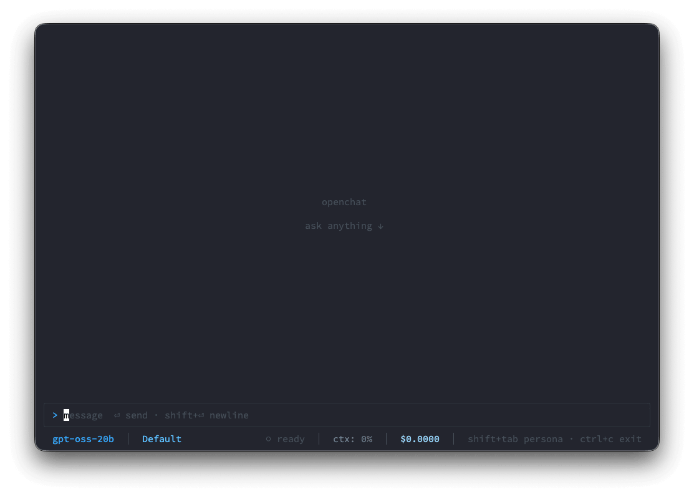
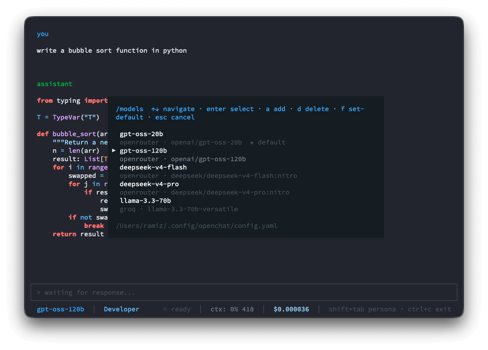
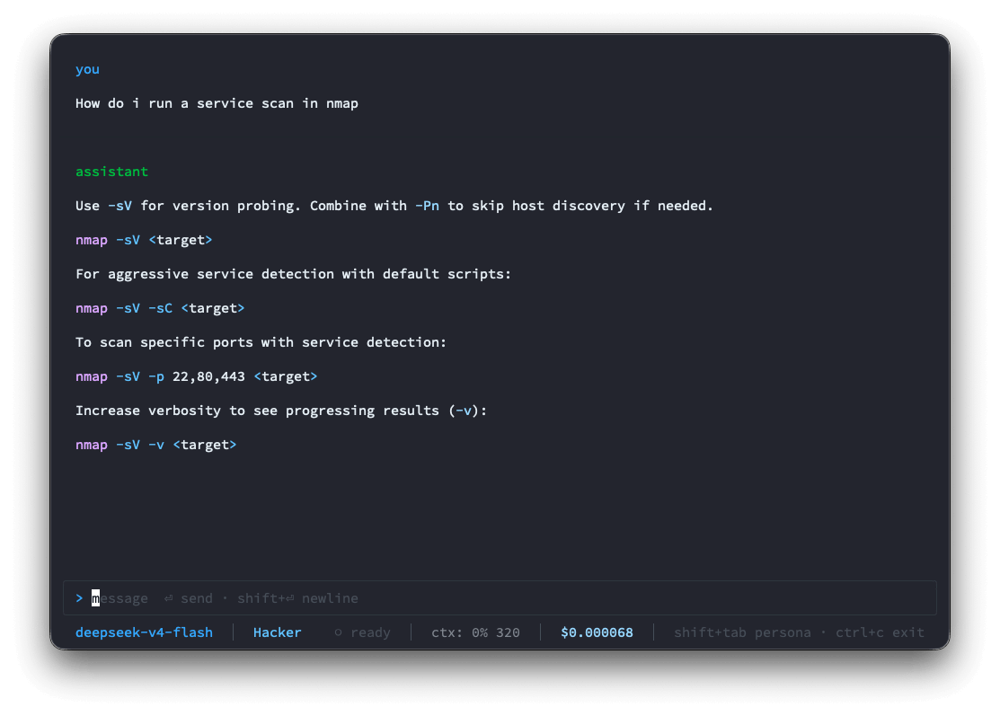

<p align="center">
  <picture>
    <source media="(prefers-color-scheme: dark)" srcset=".github/assets/openchat-logo.png">
    
  </picture>
</p>

<p align="center">
  <em>A lightning-fast, minimalist LLM TUI — quick answers in your terminal,<br>without agentic bloat or token-hungry system prompts.</em>
</p>

<p align="center">
  
  
  
  
  
  
</p>

---

## Why openchat?

Tools like **opencode** and **Claude Code** are excellent — but they inject massive system prompts and agentic guardrails before you type a single character. For a quick question, that's hundreds of wasted tokens and unnecessary overhead.

**Ollama** is great for local models, but its TUI renders responses as plain text — no markdown, no syntax highlighting, no colour. Reading code in it is painful.

**openchat** fills the gap: a minimal, fast terminal chat interface that connects to any OpenAI-compatible provider, streams token-by-token, and renders responses beautifully with full syntax highlighting. No agents, no file access, no shell execution — just a clean, trustworthy chat window you can spin up in seconds.

> Built for developers who live in the terminal and want fast, properly formatted answers without the overhead.

---

## Screenshots

<p align="center">
  
  <br>
  <sub>Clean start — model and persona shown in the status bar, ready to type</sub>
</p>

<p align="center">
  
  <br>
  <sub>Syntax-highlighted code response with the <code>/models</code> switcher open</sub>
</p>

<p align="center">
  
  <br>
  <sub>Hacker persona active — formatted terminal output for a security question</sub>
</p>

---

## Features

- ⚡ **Lightning-fast streaming** — token-by-token SSE output via the standard OpenAI streaming API; responses appear instantly as they generate
- 🎨 **Rich terminal rendering** — full Markdown formatting and syntax highlighting powered by tree-sitter; code blocks look great out of the box
- 🔌 **BYO API key** — works with [OpenRouter](https://openrouter.ai), [Groq](https://groq.com), [OpenAI](https://platform.openai.com), or any OpenAI-compatible endpoint; more providers coming
- 🎭 **Customisable personas** — four built-in system-prompt presets (Default, Hacker, Developer, Writer) plus a shared global preamble; cycle live with `Shift+Tab` without losing conversation history; fully user-editable Markdown files
- 📊 **Live session stats** — context-window percentage, running token count, and cumulative session cost shown in the status bar on every turn
- 📋 **Auto-copy on select** — mouse-drag selection copies text to the clipboard automatically (OSC 52, with `pbcopy` / `wl-copy` / `xclip` fallbacks)
- ⌨️ **Slash commands** — `/models` to switch between configured models; `/connect` to manage API keys; autosuggestion popup appears as you type `/`
- 🎨 **Themeable** — status bar colours, prompt character, and accent colours all configurable in `config.yaml`
- 🔒 **Non-destructive by design** — pure chat interface; no file access, no shell execution, no agentic tools; safe to run anywhere

---

## Supported Platforms

| Platform | Architecture |
|----------|-------------|
| macOS | arm64 (Apple Silicon) |
| Linux | x64 · arm64 |
| Windows | ❌ Not supported — use [WSL](https://learn.microsoft.com/en-us/windows/wsl/) |

---

## Installation

```bash
curl -fsSL https://raw.githubusercontent.com/iamramizk/openchat/main/scripts/install.sh | bash
```

The installer detects your OS and architecture, downloads the right binary, verifies its SHA256 checksum, and places it in `~/.local/bin`. If that directory isn't on your `$PATH` yet, the installer prints the exact line to add.

> **Custom install dir:** `OPENCHAT_INSTALL_DIR=/usr/local/bin bash install.sh`

On first launch, openchat seeds your config directory with a default `config.yaml` and persona prompt files — no manual setup needed.

---

## Updating & Uninstalling

```bash
openchat update       # download and install the latest release
openchat uninstall    # remove the binary and all config/data (prompts for confirmation)
```

Both commands work from the binary itself — no curl needed after initial install.

---

## Build from Source

Requires **[Bun](https://bun.sh) ≥ 1.2** and an API key for at least one provider.

```bash
git clone https://github.com/iamramizk/openchat.git
cd openchat
bun install
bun run start
```

Build a local binary:

```bash
bun run build:mac        # dist/openchat-darwin-arm64
bun run build:linux-x64  # dist/openchat-linux-x64
```

---

## First Run

1. **Add an API key** — type `/connect`, pick a provider, and paste your key. It's saved immediately.
2. **Choose a model** — type `/models` to see all configured models and switch with `Enter`. Press `a` to add a new model or `f` to set a boot default.
3. **Start chatting** — type your message and press `Enter` to send. `Shift+Enter` inserts a newline.
4. **Switch personas** — press `Shift+Tab` to cycle through available personas without losing your conversation.
5. **Exit** — press `Ctrl+C`.

---

## What Gets Created

On first run, openchat creates the following files — nothing is written to the repo or current directory:

| Path | Purpose |
|------|---------|
| `~/.config/openchat/config.yaml` | App config: models list, colours, default persona, prompt character |
| `~/.config/openchat/prompts/` | Persona prompt files — edit freely to customise each persona |
| `~/.local/share/openchat/auth.json` | API credentials per provider (`0600` permissions — never committed) |

Both directories respect `$XDG_CONFIG_HOME` / `$XDG_DATA_HOME` overrides if set.

The `prompts/` directory and `config.yaml` are seeded once from bundled defaults. Changes you make are preserved across updates.

---

## Commands

**In-TUI slash commands:**

| Command | Action |
|---------|--------|
| `/connect` | Opens a two-step modal: pick a provider → enter your API key. Already-saved keys show a `✓` indicator. Saves to `auth.json` immediately. |
| `/models` | Lists all models from `config.yaml`. `Enter` — switch active model · `a` — add new model · `d` — delete highlighted model · `f` — set as default (★) · `r` — rename display name |

**Binary subcommands (run from your terminal):**

| Command | Action |
|---------|--------|
| `openchat update` | Download and install the latest release; shows old → new version |
| `openchat uninstall` | Lists all files to remove, warns about API keys, asks for confirmation |
| `openchat --version` | Print installed version and exit |
| `openchat --help` | Show usage and exit |

**Keyboard shortcuts:**

| Key | Action |
|-----|--------|
| `Enter` | Send message |
| `Shift+Enter` | Insert newline |
| `Shift+Tab` | Cycle to next persona |
| `Ctrl+C` | Exit |

---

## Configuration

openchat is configured via `~/.config/openchat/config.yaml`. Here's the full shape:

```yaml
default_model: deepseek-v4-flash   # must match a name in models[]
models:
  - name: deepseek-v4-flash
    provider: openrouter
    model: "deepseek/deepseek-v4-flash:nitro"
  - name: gpt-oss-20b
    provider: openrouter
    model: "openai/gpt-oss-20b"
  - name: llama-3.3-70b
    provider: groq
    model: "llama-3.3-70b-versatile"
    context_length: 131072          # optional override if provider /models lacks it

default_persona: default            # filename prefix under prompts/

colors:
  model: "#58A6FF"                  # active model name in status bar
  persona: "#79C0FF"                # active persona name in status bar
  cost: "#A5D6FF"                   # session cost in status bar
  popup: "#161B22"                  # background for modals and autosuggest popups

prompt_char: ">"
prompt_color: "#58A6FF"
```

API keys are stored separately in `~/.local/share/openchat/auth.json` — managed automatically by `/connect`, never edit manually.

### Personas

Persona files live in `~/.config/openchat/prompts/`. Each is a plain Markdown file used as a system prompt. `_global.md` is a shared preamble prepended before every persona.

| File | Persona |
|------|---------|
| `_global.md` | Shared preamble — injected before every persona |
| `0-default.md` | General Assistant |
| `1-hacker.md` | Kali Linux & Cybersecurity Researcher |
| `2-developer.md` | Senior Software Engineer & Architect |
| `3-writer.md` | Copywriter & Editor |

Edit these files freely, or add new ones — openchat picks them up on the next launch.

---

## License

MIT © [Ramiz K](https://github.com/iamramizk)
